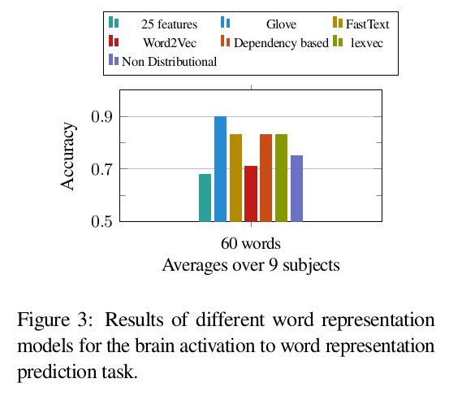
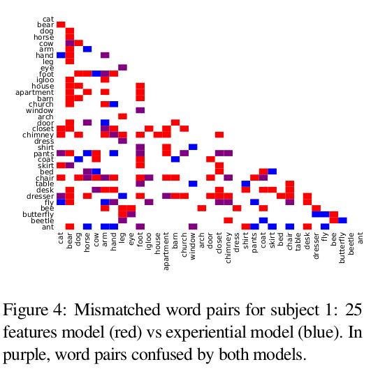
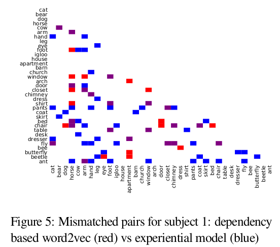
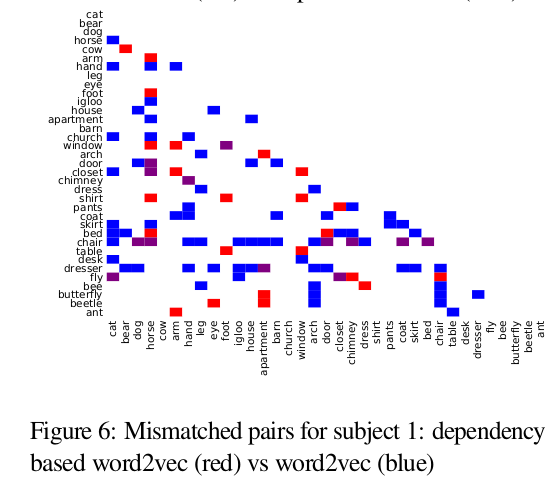
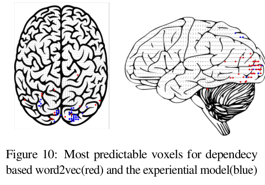
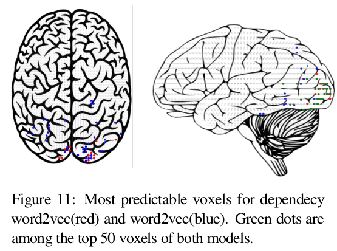

# Objective

* To evalulate the performance of word embedding models designed based on different assumptions of how meanings of words can be represented on either the task of predicting brain data from word embeddings or the reverse, predicting
word embeddings from brain data

* The basic assumption is that the better the performance of a model is the more probable it is that the way the word embedding model is built reflects what happens in the human
brain to understand a meaning of a word

* To investigate whether the information
encoded in different kind of word representations are
mutually exclusive and hence, integrating them would
result in a more powerful model

# Data

* Collection of fMRI data
that is gathered from 9 participants while exposed to
distinctive stimuli. The stimuli consisted of 60 nouns
and corresponding line drawings. Each stimulus was
displayed six times for 3 seconds in random order,
adding to a total of 360 fMRI images per participant

[Data](http://www.cs.cmu.edu/afs/cs/project/theo-73/www/science2008/data.html)

# Models

## Mapping Model

* Single layer neural network with tanh
activation, dropout and L2 regilarization

## Word Embeddings Models

### Experiential word representations

 * Meanings of the words are
coded to reflect how the corresponding concept is
experienced by humans through their senses

* A set of features is defined and crowdsourcing
is used to rate the relatedness of each feature for
each word

### Distributional word embedding models

1. Word2Vec

2. Fasttext

* Modification of word2vec
that takes morphological information into
account

* Representations are learnt
for character n-grams, and words are represented as the
sum of the n-gram vectors

3. Dependency-based Word2Vec

* Word2Vec model in which the context of the words is
computed based on the dependency relations

* Word2Vec takes the contexts of a word to be its linear context –
words that precede and follow the target word, typically in a window of k tokens to each side.

* Dependency-based Word2Vec incorporates syntactic contexts that are derived from automatically produced
dependency parse-trees

4. GloVe

### 25 verb features

* This model is based on the idea that
the neural representation of nouns is grounded in
sensory-motor features. They have manually picked
25 verbs and suggested to use the co-occurrence
counts of nouns with these 25 verbs to form the
word representations

### Non-distributional word vector representation

* In this model,
words are presented as binary vectors where each
element of the vector indicates whether the repre-
sented word has or does not have a specific feature

# Evaluation

* Each trained model was evaluated
by means of a “leave-two-out” cross-validation ap-
proach, in which the model was repeatedly trained
with all but 2 of the available word stimuli and
associated fMRI images. 
* Each trained model was
tested by requiring that it first predict the fMRI
images for the two “held-out” words and then match
these correctly to their corresponding held-out fMRI
images.  
* The match between the two predicted and the two ob-
served fMRI images was determined by which
match had a higher cosine similarity, evaluated over
the all image voxels

# Task 1: Predicting neural activation patterns using word embeddings and vice-versa

* Separate regression models are trained for each word representation
model to compute the average brain activation corre-
sponding to each word for a particular subject

## Results

* Ranking of the models differs per subject makes it difficult to make general conclusions
about the best model.

* Overall, dependency-based word2vec, GloVe and 25 features model are the
top-ranked models for at least one of the subjects

* The fact that fasttext and dependency based word2vec are performing better than
word2vec might reflect the importance of morpholog-
ical and dependency information

* In both sets of experiments, the
non-distributional word representation model has the
lowest performance. The very high dimensionality of
the brain imaging data versus the sparseness of non-
distributional word vectors make training the regres-
sion model with these vectors much harder and this
might be the primary reason for its low performance

# Task 2: Predicting word representations from brain activations

* It seems that it is very easy to construct GloVe word vectors from brain activation patterns; the model achieves an accuracy of 90 percent

* GloVe is based on the distributional semantics
hypothesis, and it is achieved by learning to predict
the global co-occurrence statistics of words in a
corpus.  
Hence, obtaining a high accuracy in the word
prediction task using GloVe, supports the fact that the
context of the words have a major role in the way we
learn the meanings of the words

* The important thing to notice is that of course as more information is encoded in the word representation, 
it becomes more powerful in predicting neural activation patterns as far as that information are relevant to some extent. 
However, this alone doesn’t imply that the exact
same information is encoded in the neural activation
patterns. The results show that, compared to
GloVe, it’s not that easy to reconstruct the Fasttext
and dependency based word vectors from the brain
activation patterns. 

* What can be concluded is
that while morphological and dependency information
is helpful in learning word representations that are to
some extent more similar to the neural representation
of nouns in our brain. This information is not
explicitly encoded in the brain activation patterns.

# Task 3: Comparing the performance of the models for different classes of nouns

* The motivation behind this task is to test the hypothesis of whether human brain uses
different mechanisms for understanding meanings of
different categories of words

* To investigate
this, the miss matched noun pairs for
each of the word representation models are analyzed
  

  

* While there is some
overlap between the mistakes of the 25 features model
and the experiential model, considerable number of
mismatched pairs are not in common between them.

* One interesting fact about the 25 features model
is that for some specific nouns ie. “bear”, “foot”,
“chair”, and “dresser”, no matter what is its pair,
discrimination performance is poor. eg. “bear” is not
only confused with other animals, but also with some
body parts, places and etc

* This could
be a side effect of using co-occurrence statistics from
corpora to learn word representations and could show
that for some reason the representations learned for
these nouns are not distinguishable from other nouns

  

* Here again there is a considerable amount of
overlap. They both perform equally for discriminating
among animals. But the experiential model makes
more mistake about “body parts” and “insects”

  

* Discriminating some words eg. “chair” is difficult for word2vec while it’s not the case for dependency based word2vec.

* It seems like both experiential attributes of nouns and
the dependency information is helping in learning
more distinguishable representations for nouns
  

## Further Comparison(for a bit of insight)

### GloVe vs Dependency-based Word2Vec

* For GloVe, similar to the 25 features
model and the experiential model, ‘arm’ is one of the
hardest to discriminate nouns. But the ‘body parts’
category is not as confusing as for the experience
based models

* For the dependency-based word2vec,
the patterns of errors are somehow different and
the most difficult word seems to be ‘fly’. This is
because ‘fly’ can be either verb and noun, and since
it is more frequent as a verb, the dependency-based model is learning the representation of its verb form

* For GloVe, this is not very problematic because it is
only based on co-occurrence counts, thus an average
representation is learned

* In general, despite the
fact that these two models are based on different
assumptions their mismatches have more overlap than
for the two experiential models. This may be a side
effect of the fact that they both make fewer mistakes

# Task 4: Comparing most predictable voxels in the brain for each word embedding model

* The aim is to investigate if our brain uses a
<i>combination</i> of different mechanisms and whether different groups of voxels in the brain are responsible for
processing each aspect

* Predictability of different voxels with each word model is analyzed. 
Top 50 most predictable voxels for each model have been identified
  

  

  

* The green colour indicates
the common top voxels between the two models.
 
* There is a lot more
overlap between the dependency based word2vec and
word2vec, compared to the experiential model
 

## Mixed Model Experiment

* To explore whether it is possible to improve
the accuracy of predicting neural activation patterns
by employing a combined model

* The dependency based Word2Vec is integrated with the experience based models - the 25 verbs model and the experiential mode

* Results show that a linear combination doesn’t lead to an
improvement in the accuracy over the limited set of
words

* However, linearly combining the 25 feature model with the dependency based word2vec leads to an accuracy of 82
percent over the 60 nouns, which is 2 percent higher
than the accuracy of the dependency-based model

# Conclusion and Remarks

* One of the main problems
of the corpus based distributional models that we have
applied is that they do not account for different senses
of the words.  
Hence, the representations they learn
for words with more than one sense can be noisy and
biased toward the most frequent sense

* The authors think it is possible to build new models upon
the dependency based word2vec which also encode
experiential information.  
One possible approach to achieve this goal is to train word embedding models in a multi-task learning framework with the downstream tasks that reflect different types of real-life
experiences in addition to language modelling tasks

# References

* [Experiential, Distributional and Dependency-based Word Embeddings have Complementary Roles in Decoding Brain Activity](https://arxiv.org/abs/1711.09285)

